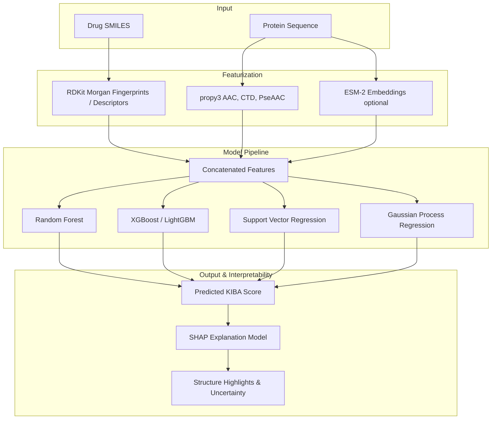

# DTI-ML: Interpretable Kinase Drug-Target Affinity Prediction

DTI-ML is a machine learning pipeline and interactive web application for predicting the binding affinity (continuous KIBA scores) between small-molecule drug candidates and kinase protein targets. 

Unlike standard drug-target interaction (DTI) models that suffer from similarity-based performance inflation, DTI-ML is built from the ground up with **leakage-free cold-split evaluation protocols** and **SHAP-based chemical/biological interpretability**.

---

## 🌟 Key Features

*   **Leakage-Safe Evaluation (Cold-Splits):** Explicitly evaluates models under three scenarios: standard random splits, unseen-drug splits (novel therapeutics), and unseen-protein splits (novel kinase targets) to accurately estimate real-world generalizability.
*   **Multi-Model Classical Benchmark:** Rigorous comparison across four diverse regressors:
    *   Random Forest Regressor
    *   Gradient Boosting (XGBoost & LightGBM)
    *   Support Vector Regression (SVR)
    *   Gaussian Process Regression (GPR) (providing native uncertainty quantification)
*   **Multi-Modal Feature Extraction:**
    *   *Drugs:* RDKit-derived Morgan (ECFP) fingerprints + physical-chemical descriptors.
    *   *Proteins:* Amino Acid Composition (AAC), Composition/Transition/Distribution (CTD), Pseudo Amino Acid Composition (PseAAC), and optional pre-trained protein language model embeddings (ESM-2).
*   **Explainable AI (XAI):** SHAP-based feature attribution mapped back onto 2D molecular structures and sequence-based descriptors, making predictions transparent and chemically verifiable.
*   **React + FastAPI Application:** A mockup-faithful web interface allowing researchers to paste SMILES strings and protein sequences, choose a model, visualize binding affinity, view prediction confidence, and inspect SHAP explanations.

---

## 🏗️ System Architecture



---

## 📁 Repository Structure

```text
├── app/                  # Reusable Python application helpers
├── backend/              # FastAPI prediction, benchmark, and chatbot API
└── frontend/             # React production interface matching the mockup
├── data/                 # Raw datasets, cleaning scripts, and split files
│   └── build_kiba_dataset.py
├── features/             # Feature extraction and ablation code
├── models/               # Model training, tuning, and checkpoint storage
├── paper/                # LaTeX manuscript, figures, and academic draft
├── requirements.txt      # Python dependencies
└── plan.md               # 4-week execution roadmap
```

---

## 🚀 Getting Started

### 1. Environment Setup

Clone this repository and set up a virtual environment:

```bash
# Create virtual environment
python -m venv venv

# Activate virtual environment
# On Windows:
venv\Scripts\activate
# On macOS/Linux:
source venv/bin/activate
```

### 2. Install Dependencies

Install the required scientific computing, cheminformatics, and machine learning libraries:

```bash
pip install -r requirements.txt
```

### 3. Configure Variables

Create your local environmental settings by copying the example template:

```bash
cp .env.example .env
```

---

## 🏃 Pipeline Execution Workflow

### Step 1: Download & Build Datasets
Run the dataset builder to pull the KIBA dataset, perform initial cleaning, and partition it into leakage-safe splits:
```bash
python data/build_kiba_dataset.py
```

### Step 2: Feature Extraction
*(Refer to `features/` directory for extraction scripts)*
Generate the compound Morgan fingerprints and protein sequence descriptors, caching feature matrices to disk.

### Step 3: Model Training & Evaluation
*(Refer to `models/` directory for model scripts)*
Train the benchmark regressors and tune hyper-parameters on the splits. Checkpoints and evaluation metrics will be exported.

### Step 4: Launch the API
Run the FastAPI backend locally:
```bash
uvicorn backend.main:app --reload
```

### Step 5: Launch the React frontend
In a second terminal:
```bash
cd frontend
npm install
npm run dev
```

The frontend runs at `http://localhost:5173` and calls the API at `http://127.0.0.1:8000` by default. Set `VITE_API_BASE` when the API is hosted elsewhere.

---

## 📝 License
This project is licensed under the MIT License. See the LICENSE file for details.
