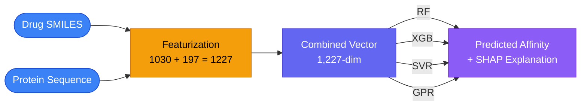
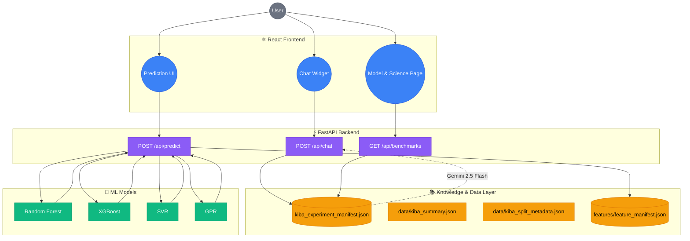

# DTI-ML

Predicting kinase drug-target binding affinity with classical ML, leakage-safe cold-split evaluation, and SHAP-based explainability.

[](https://python.org)
[](https://github.com/deepchem/deepchem/tree/master/deepchem/data/datasets/data)
[](https://github.com/sivaa1999/drug-target-interactions/blob/main/models/kiba_results.csv)
[](#)

- **[🧬 What This Project Does](#-what-this-project-does)**
- **[🧬 Research Foundation](#-research-foundation)**
- **[🏗️ Architecture](#-architecture)**
- **[🚀 Setup](#-setup)**
- **[🧪 Tests and Build](#-tests-and-build)**
- **[💾 Data and Models](#-data-and-models)**
- **[🚀 Production](#-production)**
- **[🔍 Explainability](#-explainability)**

---

## 🧬 What This Project Does

Drug-target interaction (DTI) prediction asks a deceptively simple question: given a small molecule drug and a protein target, how tightly will they bind? The answer — a quantitative binding affinity score — is one of the most consequential inputs in modern drug discovery, yet measuring it experimentally requires costly wet-lab assays that take weeks per compound and demand specialized equipment. A computational predictor that can pre-filter candidate compounds before any lab work begins has the potential to compress years of effort and millions of dollars into a single screening step.

DTI-ML addresses this problem for **protein kinases**, one of the largest and most therapeutically relevant families of drug targets. The system takes as input a drug SMILES string and a protein amino-acid sequence, and outputs a predicted binding affinity score on the KIBA scale — higher scores indicate tighter binding.

### Input → Output

A concrete example: the drug **Aspirin** (`CC(=O)OC1=CC=CC=C1C(=O)O`) paired with the kinase target **ABL1**, encoded as a protein sequence of ~387 amino acids. Feeding this pair through the ML pipeline produces:



Each of the four models — Random Forest, XGBoost, SVR, and Gaussian Process Regression — produces its own prediction, and the system reports which molecular substructures and protein features drove the result.

### Why Cold-Split Evaluation Is the Core Contribution

Standard machine-learning evaluation uses random train/test splits, which appears straightforward but is deeply misleading for DTI prediction. In the KIBA dataset, similar drug molecules and homologous kinase proteins appear across the entire dataset. A random split often places near-duplicates in both training and test sets, so the model can achieve high accuracy by memorizing structural patterns rather than learning genuine binding determinants. This produces **artificially optimistic metrics** that collapse when the model encounters genuinely novel compounds or targets — the exact scenario that matters in real drug discovery.

Cold-split evaluation eliminates this leak by enforcing strict separation:

- **Cold-Drug Split**: Every drug in the test set has zero overlap with the training set by drug ID and canonical SMILES. The model is tested on entirely novel drug candidates it has never seen — this measures whether it has learned to recognize *molecular pharmacophores* rather than memorizing specific structures.
- **Cold-Protein Split**: Every protein in the test set has zero overlap with the training set by protein ID and amino-acid sequence. The model is tested on entirely novel kinase targets — this measures whether it has learned *target-agnostic binding principles* rather than memorizing specific protein profiles.

This distinction matters because a model that performs well on random splits but poorly on cold splits has not actually learned to predict binding affinity; it has learned to exploit dataset artifacts. Cold-split evaluation is the mechanism that separates genuine predictive power from memorization.

### Why Classical ML Instead of Deep Learning

This project deliberately uses classical machine learning — Random Forest, XGBoost, SVR, and Gaussian Process Regression — rather than deep neural networks. The choice is a **design decision, not a limitation**. With 118,254 interactions across 2,111 drugs and 229 proteins, the dataset is well-sized for classical models but modest by deep-learning standards. Classical models offer three advantages here: **interpretability** via SHAP feature attribution, **data efficiency** without the need for large-scale pretraining or GPU infrastructure, and **faster iteration** for hyperparameter tuning and comparison across splits. Deep learning would add complexity without a proportionate gain in understanding.

### The Explainability Angle

A black-box model tells you the score but not why. SHAP (SHapley Additive exPlanations) decomposes each prediction into per-feature contributions, revealing exactly which molecular substructures — such as specific Morgan fingerprint bits corresponding to aromatic ring systems or hydrogen-bond donor patterns — and which protein composition features — such as amino-acid composition or CTD solvent accessibility profiles — pushed the score up or down. This turns a prediction from an opaque number into a testable scientific hypothesis, allowing a researcher to inspect whether the model is relying on chemically meaningful patterns rather than dataset artifacts.

---

## 🧬 Research Foundation

### Dataset

| Property | Value |
|---|---|
| Dataset | **KIBA** (Kinase Inhibitor BioActivity benchmark) |
| Interactions | **118,254** |
| Unique drugs | **2,111** |
| Canonical SMILES | **2,068** |
| Proteins | **229** |

### Feature Representation

| Component | Dimensions | Description |
|---|---|---|
| Drug features | **1,030** | Morgan ECFP4 (1,024-bit) + 6 descriptors (MW, LogP, TPSA, HBD, HBA, Rotatable Bonds) |
| Protein features | **197** | AAC (20-dim) + CTD (147-dim) + PSEAAC (30-dim) |
| **Combined** | **1,227** | Concatenated representation |

### Evaluation

| Split | Purpose | Leakage Prevention |
|---|---|---|
| **Random Split (Baseline)** | Standard evaluation | N/A |
| **Cold-Drug Split** | Unseen drug candidates | `drug_id_overlap = 0`, `canonical_smiles_overlap = 0` |
| **Cold-Protein Split** | Unseen protein targets | `protein_id_overlap = 0`, `protein_sequence_overlap = 0` |

| Detail | Value |
|---|---|
| Models | Random Forest, XGBoost, SVR, GPR |
| Experiment cells | **12** (3 splits × 4 models) |
| Random seed | **seed = 42** |
| Metrics | MSE, RMSE, Pearson _r_, Concordance Index (CI) |

Authoritative current results: `models/kiba_results.csv`, `models/kiba_detailed_results.csv`, `models/kiba_experiment_manifest.json`.

> **Important — Legacy Synthetic Data**  
> Legacy synthetic/development benchmark data may exist in the repository for testing and development purposes. It is **NOT** the current research evaluation. The current evaluation uses real KIBA data with the 1,227-dimensional representation and leakage-safe cold splits described above.

---

## 🏗️ Architecture



### Data and Model Layer

- **KIBA data**: Real kinase inhibitor bioactivity data
- **Feature representations**: Drug (1,030-dim) and protein (197-dim) feature vectors
- **Trained model artifacts**: Checkpoints under `models/artifacts/` for each model and split
- **Experiment results/manifest**: `models/kiba_experiment_manifest.json` with full results matrix and best models per split

### Chatbot

The chatbot provides project-grounded Q&A:

- **POST** `/api/chat` with a question and optional prediction context
- **Project-knowledge retrieval** from `kiba_experiment_manifest.json`, `kiba_summary.json`, `kiba_split_metadata.json`, and `feature_manifest.json`
- **Gemini 2.5 Flash** generates grounded answers with source references
- **Rate limiting**: 18 messages per session per hour
- **Guardrails**: Blocked-pattern filter, refusal for off-topic/medical questions, fallback when no API key
- **Local cache** for common questions (score meaning, cold-split rationale, SHAP explanation)

> The chatbot uses lightweight keyword-based knowledge retrieval — not vector databases, embeddings, or LangChain.

---

## Repository Guide

```text
backend/       FastAPI routes, services, schemas, and tests
frontend/      React production interface
features/      Drug and protein feature extraction
evaluation/    Metrics and interpretability
models/        Checkpoints, benchmark results, and experiment manifest
data/          Dataset summaries, split metadata, and source data
paper/         IEEE manuscript and figures
docs/archive/  Historical planning documents
```

Use [CONTRIBUTING.md](CONTRIBUTING.md) for extension and maintenance rules. Use [PRODUCT_DESIGN.md](PRODUCT_DESIGN.md) for UI and interaction requirements.

---

## 🚀 Setup

```powershell
python -m venv venv
.\venv\Scripts\Activate.ps1
python -m pip install -r requirements.txt
cd frontend
npm ci
```

Copy `.env.example` to `.env` and `frontend/.env.example` to `frontend/.env`. Configure `VITE_API_BASE` for the frontend and `DTI_ALLOWED_ORIGINS`, `DTI_MODELS_DIR`, `DTI_API_VERSION`, and optional `GEMINI_API_KEY` for the API.

---

## 🚀 Run Locally

Start the API from the repository root:

```powershell
.\venv\Scripts\python.exe -m uvicorn backend.main:app --reload
```

Start the frontend in another terminal:

```powershell
cd frontend
npm run dev
```

The default URLs are `http://127.0.0.1:8000` for the API and `http://localhost:5173` for the frontend.

---

## 🧪 Tests and Build

```powershell
# Repository root
.\venv\Scripts\python.exe -m compileall backend app/helpers.py features evaluation
.\venv\Scripts\python.exe -m pytest -q

# frontend/
npm ci
npm test -- --run
npm run build
npm run test:e2e
```

Playwright E2E tests start the local FastAPI and Vite servers automatically. The successful prediction flow uses the real local model; only deterministic error cases use API interception. Install Chromium once with `npx playwright install chromium` when browser tooling is available. E2E screenshots and reports are written to ignored test-output directories.

---

## 💾 Data and Models

Run the data pipeline and training scripts only when intentionally regenerating artifacts:

```powershell
python data/build_kiba_dataset.py
python features/featurizer.py
python models/train_models.py
```

> **Note** — Model checkpoints are ignored by Git and must be present under `DTI_MODELS_DIR` at runtime. Authoritative current result files are `models/kiba_results.csv`, `models/kiba_detailed_results.csv`, and `models/kiba_experiment_manifest.json`. The checked-in `models/results.csv` supplies the science-page benchmark table.

---

## 🚀 Production

Build the frontend and run the API with production hosts:

```powershell
cd frontend
npm ci
npm run build

cd ..
.\venv\Scripts\python.exe -m uvicorn backend.main:app --host 0.0.0.0 --port 8000
```

Serve `frontend/dist` from a static host or reverse proxy. Add the deployed frontend origin to `DTI_ALLOWED_ORIGINS`. Deployment is currently manual; no hosted environment or CI/CD pipeline is included.

`frontend/package-lock.json` and `requirements-lock.txt` provide reproducible dependency snapshots. Regenerate the Python snapshot only after intentional dependency changes:

```powershell
python -m pip install -r requirements.txt
python -m pip freeze > requirements-lock.txt
```

---

## 🔍 Explainability

SHAP-based feature attribution is available for individual predictions. The system reports which drug substructure features (Morgan fingerprint bits, physicochemical descriptors) and protein composition features (AAC, CTD, PSEAAC) contributed most to the predicted binding affinity, with both positive and negative contributions identified.
